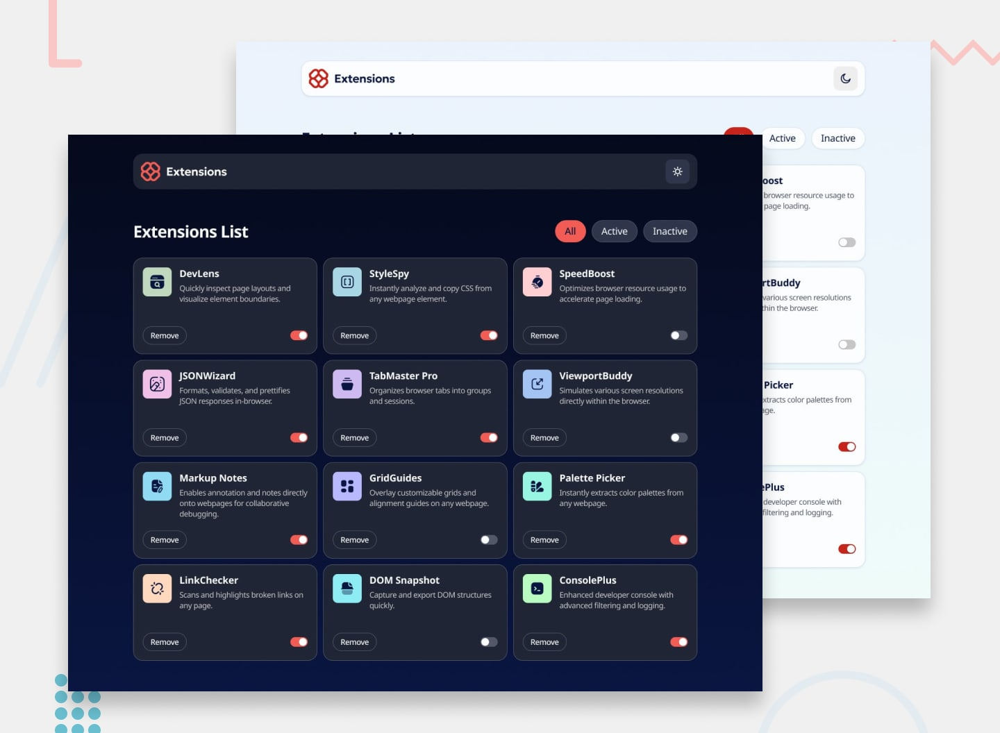

# Browser Extensions Manager UI Main

Projeto desenvolvido como solução para um desafio do Frontend Mentor.

## Sobre

Aplicação que consome um `data.json` e permite:

- listar extensões do navegador
- adicionar e remover as extensões
- filtrar as extensões por ativas ou inativas
- alterar o tema para dark mode ou light mode

---

## Tecnologias

- React
- TypeScript
- Tailwind
- Vite
- Git

---

## Preview

Link: https://wholetomy.github.io/browser-extensions-manager-ui-main/




---

## O que aprendi

- React Hooks (useState, useEffect e useLayoutEffect)
- Consumo de dados em JSON
- Componentização
- Estrutura do Tailwind
- Tipagem com TypeScript
- Animações em Tailwind
- Temas com Tailwind

---

## Instalação

```bash
git clone https://github.com/wholetomy/browser-extensions-manager-ui-main

cd browser-extensions-manager-ui-main

npm install

npm run dev
```

---

## Melhorias futuras

- Testes unitários
- Animações mais suaves
- Skeleton Loading
- Deploy automático
- Adição de backend para trazer os dados
- Possibilidade de cadastrar extensões novas
- Possibilidade de pesquisar extensões através de um campo de texto
- Tela própria para cada extensão

---

## Autor

Thomas Campanholi
